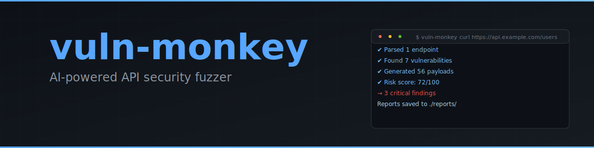

<p align="center">
  
</p>

<p align="center">
  <a href="https://github.com/cdbkk/vuln-monkey/actions/workflows/ci.yml"></a>
  <a href="https://www.npmjs.com/package/vuln-monkey"></a>
  <a href="LICENSE"></a>
  <a href="https://github.com/cdbkk/vuln-monkey/stargazers"></a>
</p>

<p align="center">
  <b>Paste a curl command. Get a vulnerability report.</b><br/>
  No API keys needed. Works with your existing Claude, Gemini, or Codex subscription.
</p>

---

<br/>

## Table of Contents

- [Quick Start](#quick-start)
- [Demo](#demo)
- [Models & Backends](#models--backends)
- [How It Works](#how-it-works)
- [Usage](#usage)
- [Risk Scoring](#risk-scoring)
- [Safety & Guardrails](#safety--guardrails)
- [Tech Stack](#tech-stack)
- [Development](#development)

<br/>

## Quick Start

Install globally:

```bash
npm install -g vuln-monkey
```

Fuzz an API endpoint:

```bash
vuln-monkey "curl -X POST https://api.example.com/users \
  -H 'Authorization: Bearer tok_xxx' \
  -d '{\"name\":\"test\"}'"
```

That's it. It uses your Claude Code subscription by default. Zero configuration.

Outputs:
- Terminal summary with severity colors.
- Markdown report with payload details.
- JSON export for CI/automation.
- All written to `./reports/`.

<br/>

## Demo

```
$ vuln-monkey "curl -X POST https://api.example.com/users -H 'Authorization: Bearer tok_xxx' -d '{\"name\":\"test\"}'"

✔ Parsed 1 endpoint(s)
✔ Found 7 potential vulnerabilities
✔ Generated 56 payloads

[1/56]   200  23ms  IDOR - Access user 2's profile
[2/56]   200  31ms  IDOR - Access user 999
[3/56]   500  89ms  Injection - SQL in name field
[4/56]   401  12ms  Auth bypass - Missing token validation
[5/56]   200  28ms  Mass assignment - Set role to admin
[6/56]   400  15ms  Type juggling - Integer as name
[7/56]   429  8ms   Rate limiting bypass - Rapid requests
...

VULN MONKEY REPORT
Target:             https://api.example.com/users
Model:              claude-cli
Endpoints scanned:  1
Payloads fired:     56
Duration:           14.23s
Findings:           3

  CRITICAL  CRASH: Injection - SQL in name field — https://api.example.com/users
  HIGH      ERROR: Type juggling - Integer as name — https://api.example.com/users
  MEDIUM    SUSPICIOUS: IDOR - Access user 2's profile — https://api.example.com/users

Risk score: 67/100
Risk rating: Needs Attention

Reports written:
  Markdown: ./reports/vuln-monkey-2026-04-03T12-00-00.000Z-a3f2c1.md
  JSON:     ./reports/vuln-monkey-2026-04-03T12-00-00.000Z-a3f2c1.json
```

<br/>

## Models & Backends

8 LLM backends. Use what you have.

<details open>
<summary><b>CLI Backends</b> &mdash; free, uses your existing subscriptions</summary>

<br/>

| Backend | Requires | Command |
|:--------|:---------|:--------|
| **claude-cli** *(default)* | Claude Code CLI | `vuln-monkey "curl ..."` |
| **gemini-cli** | Gemini CLI | `vuln-monkey --model gemini-cli "curl ..."` |
| **codex-cli** | Codex CLI | `vuln-monkey --model codex-cli "curl ..."` |

Zero config. No API keys. Reads from your CLI subscriptions automatically.

```bash
# Uses Claude Code (default)
vuln-monkey "curl https://api.example.com/users"

# Switch to Gemini
vuln-monkey --model gemini-cli "curl https://api.example.com/users"

# Or Codex
vuln-monkey --model codex-cli "curl https://api.example.com/users"
```

</details>

<details>
<summary><b>API Backends</b> &mdash; for CI/CD, automation, direct API access</summary>

<br/>

| Backend | API Provider | Env Var |
|:--------|:-------------|:--------|
| **claude** | Anthropic API | `ANTHROPIC_API_KEY` |
| **gemini** | Google Generative AI | `GEMINI_API_KEY` |
| **openai** | OpenAI (GPT-4o, etc) | `OPENAI_API_KEY` |

Requires API keys. Useful for CI pipelines.

```bash
ANTHROPIC_API_KEY=sk-... vuln-monkey --model claude "curl https://api.example.com/users"
OPENAI_API_KEY=sk-... vuln-monkey --model openai "curl https://api.example.com/users"
GEMINI_API_KEY=... vuln-monkey --model gemini "curl https://api.example.com/users"
```

</details>

<details>
<summary><b>Local LLMs</b> &mdash; run entirely offline, on your machine</summary>

<br/>

| Backend | Runs | Config |
|:--------|:-----|:-------|
| **ollama** | Ollama (localhost:11434) | Just `ollama serve` |
| **local** | Any OpenAI-compatible server | `OPENAI_BASE_URL` env var |

Compatible with Ollama, LM Studio, vLLM, llama.cpp, text-generation-webui, or anything serving `/v1/chat/completions`.

```bash
# Ollama — auto-connects to localhost:11434
ollama serve &
vuln-monkey --model ollama "curl https://api.example.com/users"

# LM Studio, vLLM, or custom OpenAI-compatible server
OPENAI_BASE_URL=http://localhost:1234/v1 vuln-monkey --model local "curl https://api.example.com/users"
```

</details>

<br/>

## How It Works

```
            ┌──────────────────────┐
            │ curl / OpenAPI spec  │
            └──────────┬───────────┘
                       │
            ┌──────────▼───────────┐
            │  Parse endpoints     │
            └──────────┬───────────┘
                       │
            ┌──────────▼───────────┐
            │ LLM analysis         │  ◄─ Identifies IDOR, SQL injection,
            └──────────┬───────────┘     auth bypass, mass assignment, etc.
                       │
            ┌──────────▼───────────┐
            │ Generate payloads    │  ◄─ Creates attack variants
            └──────────┬───────────┘     (8-10 per vulnerability)
                       │
            ┌──────────▼───────────┐
            │ Fire requests        │  ◄─ Concurrent + SSRF protection
            └──────────┬───────────┘
                       │
            ┌──────────▼───────────┐
            │ Classify responses   │  ◄─ pass / suspicious / error / crash
            └──────────┬───────────┘
                       │
            ┌──────────▼───────────┐
            │ Generate reports     │  ◄─ Terminal, Markdown, JSON
            └──────────────────────┘
```

<br/>

## Usage

### Input Modes

**Curl command:**

```bash
vuln-monkey "curl -X POST https://api.example.com/users -d '{\"name\":\"test\"}'"
```

**OpenAPI specification:**

```bash
vuln-monkey --spec https://api.example.com/openapi.json
```

**Dry run (preview payloads without firing):**

```bash
vuln-monkey --dry-run "curl https://api.example.com/users"
```

### CLI Options

| Option | Description | Default |
|:-------|:-----------|:--------|
| `--spec <url>` | OpenAPI/Swagger spec URL | — |
| `--model <name>` | LLM backend (see [Models](#models--backends)) | `claude-cli` |
| `--output <dir>` | Report output directory | `./reports` |
| `--concurrency <n>` | Parallel requests | `5` |
| `--timeout <ms>` | Request timeout in milliseconds | `10000` |
| `--dry-run` | Generate payloads without firing | `false` |

### Examples

Fuzz a protected endpoint:

```bash
vuln-monkey "curl -X GET https://api.example.com/users/42 \
  -H 'Authorization: Bearer token_xyz'"
```

Fuzz an entire API using OpenAPI spec:

```bash
vuln-monkey --spec https://api.example.com/v1/openapi.json \
  --model openai --concurrency 10
```

Fuzz with a local LLM, 20s timeout:

```bash
vuln-monkey --model ollama --timeout 20000 \
  "curl -X POST https://api.example.com/login -d '{\"password\":\"test\"}'"
```

Preview payloads before execution:

```bash
vuln-monkey --dry-run "curl https://api.example.com/users"
```

<br/>

## Risk Scoring

Findings are weighted by severity and summed into a 0-100 risk score.

| Severity | Weight | Risk 0-39 | Risk 40-69 | Risk 70-100 |
|:---------|:------:|:---------:|:---------:|:----------:|
| **Critical** | 25 | — | — | **Fail** |
| **High** | 15 | — | **Needs Attention** | — |
| **Medium** | 5 | **Acceptable** | — | — |
| **Low** | 2 | **Acceptable** | — | — |

Scores aggregate across all findings. A single critical vulnerability = 25 points. Two critical + one high = 65 points (Needs Attention).

<details>
<summary><b>Vulnerability categories</b></summary>

<br/>

vuln-monkey identifies:

- **IDOR / BOLA** - Insecure Direct Object References
- **Injection** - SQL, NoSQL, command injection
- **Auth Bypass** - Missing/weak authentication
- **Mass Assignment** - Unintended field exposure
- **Type Juggling** - Type coercion vulnerabilities
- **Rate Limiting Bypass** - No/weak rate limits
- **Race Conditions** - Concurrency issues
- **Overflow** - Integer/buffer overflow
- **Data Exposure** - Excessive information disclosure
- **CORS Misconfiguration** - Broken CORS policies
- **Info Disclosure** - Stack traces, version leaks

</details>

<br/>

## Safety & Guardrails

vuln-monkey is a security testing tool with built-in protections:

| Protection | What It Does |
|:-----------|:------------|
| **SSRF Guard** | Blocks requests to localhost, private IPs, link-local, AWS metadata |
| **Redirect Control** | Does not follow HTTP redirects |
| **Response Cap** | 1 MB max response body to prevent memory exhaustion |
| **Credential Redaction** | Authorization headers masked in Markdown reports |
| **Path Validation** | Prevents report writes to sensitive system directories |

**Legal notice:** This tool is for authorized security testing only. Always get written permission before testing APIs you do not own or operate.

<br/>

## Tech Stack

<p>
  
  
  
  
  
  
  
  
</p>

**Core:** TypeScript, Node.js 20+, Zod validation

**CLI:** Commander, Chalk, Ora spinners

**Testing:** Vitest, 68 passing tests

**LLM Support:** Claude, Gemini, OpenAI, Ollama

<br/>

## Development

Clone and install:

```bash
git clone https://github.com/cdbkk/vuln-monkey.git
cd vuln-monkey
npm install
```

Run tests:

```bash
npm test              # run once
npm run test:watch    # watch mode
```

Type check:

```bash
npx tsc --noEmit
```

Try locally:

```bash
npm run dev -- --help
npm run dev -- "curl https://api.example.com/users"
```

<br/>

## Requirements

- **Node.js** 20+
- **One of:**
  - Claude Code CLI (`claude` command)
  - Gemini CLI (`gemini` command)
  - Codex CLI (`codex` command)
  - API key for Claude, Gemini, or OpenAI
  - Local LLM running on localhost (Ollama, LM Studio, etc.)

<br/>

## Contributing

Found a bug? Have a feature idea? Pull requests welcome.

See [CONTRIBUTING.md](CONTRIBUTING.md) for setup and guidelines.

<br/>

## License

[MIT](LICENSE) — Build what you want.

<br/>

---

<p align="center">
  <b>vuln-monkey</b> • <a href="https://github.com/cdbkk/vuln-monkey">GitHub</a> • <a href="https://www.npmjs.com/package/vuln-monkey">npm</a>
  <br/>
  <br/>
  Built with <a href="https://claude.com">Claude</a>
</p>
